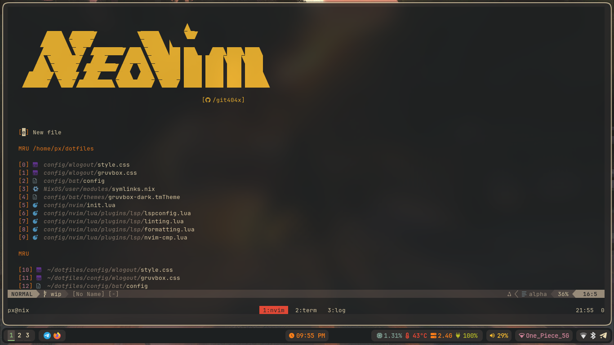

# my neovim configuration

This repository contains my personal setup for neovim.

## Installation

To get started with my neovim configuration, follow these steps:

- **Install Dependencies**:
  (setup a nerd-font in terminal)

  ```bash
  yay -S ttf-jetbrains-nerd make gcc ripgrep fzf python3 nodejs npm
  ```

- **Clone the Repository**:

  ```bash
  cp -r dotfiles/config/nvim ~/.config/nvim
  ```

- **Preview**
  
